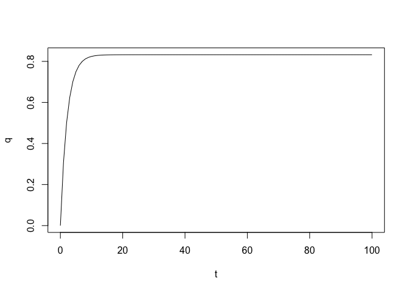
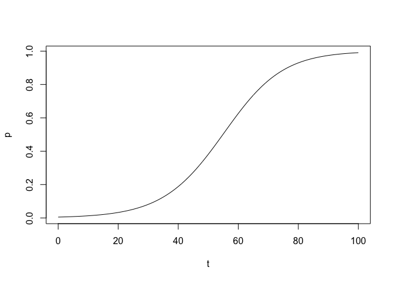
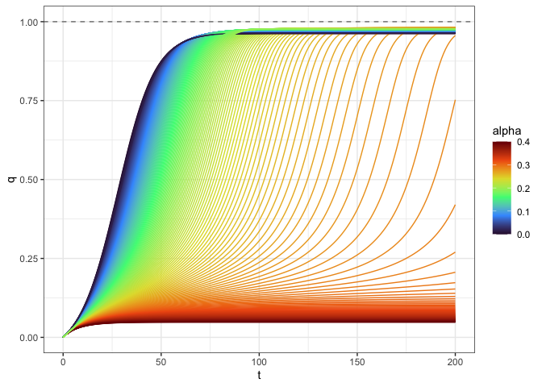

<!-- README.md is generated from README.Rmd. Please edit that file -->

# culturalEvolution

<!-- badges: start -->
<!-- badges: end -->

**`culturalEvolution`** provides a set of convenient functions for
models of cultural evolution and/or diffusion processes.

## Installation

You can install the development version of **`culturalEvolution`** from
[GitHub](https://github.com/) with:

``` r
# install.packages("devtools")
devtools::install_github("acastroaraujo/culturalEvolution")
```

Currently available functions:

- `recursion()`

## Recursion

``` r
library(culturalEvolution)
```

You can construct *any* model with the `recursion()` function, a
mathematical expression, and the name of the “state variable.”

Each of these models is now a *new* function of class “rfun” with the
following arguments:

- `params` a list or data frame of parameters that match those in the
  mathematical expression.

- `init` the proportion of the state variable or “trait” at time zero.

- `tn` the number of time periods.

Here are two very simple models from Henrich (2001):

``` r

env_learn <- recursion(
  var = q,
  expr = q + (1 - q)*P1 - q*P2
)

env_learn 
#> Recursive equation:
#> q' = q + (1 - q) * P1 - q * P2 
#> 
#> Required parameters:
#> P1, P2

out <- env_learn(
  params = list(P1 = 0.308, P2 = 0.062), 
  tn = 100
)

str(out)
#> tibble [101 × 5] (S3: tbl_df/tbl/data.frame)
#>  $ .id: Factor w/ 1 level "1": 1 1 1 1 1 1 1 1 1 1 ...
#>  $ t  : int [1:101] 0 1 2 3 4 5 6 7 8 9 ...
#>  $ q  : num [1:101] 0 0.308 0.502 0.624 0.701 ...
#>  $ P1 : num [1:101] 0.308 0.308 0.308 0.308 0.308 0.308 0.308 0.308 0.308 0.308 ...
#>  $ P2 : num [1:101] 0.062 0.062 0.062 0.062 0.062 0.062 0.062 0.062 0.062 0.062 ...

out |> 
  dplyr::select(t, q) |> 
  plot(type = "l")
```



``` r

biased_transmission <- recursion(
  var = p,
  expr = p + p*(1 - p)*B
)

biased_transmission
#> Recursive equation:
#> p' = p + p * (1 - p) * B 
#> 
#> Required parameters:
#> B

out <- biased_transmission(
  params = data.frame(B = 0.1), 
  init = 0.005,  ## q cannot start as zero in this model!
  tn = 100
)

out |> 
  dplyr::select(t, p) |> 
  plot(type = "l")
```



**Using parameter data frames**

You can supply lists of parameters in the form of data frames (i.e., one
combination per row).

Here we create a similar graph to Figure 11 in Henrich (2001, 1006):

``` r
comb_mod <- recursion(
  var = q,
  expr = q + 0.5*(P1 + (L-1)*q) + 0.5*q*(1-q)*(b*(1 - a) + a*(2*q - 1))
)

grid <- tidyr::crossing(
  a = seq(0, 0.4, length.out = 200),
  b = 0.2, 
  L = 0.98, 
  P1 = 0.012
)

str(grid)
#> tibble [200 × 4] (S3: tbl_df/tbl/data.frame)
#>  $ a : num [1:200] 0 0.00201 0.00402 0.00603 0.00804 ...
#>  $ b : num [1:200] 0.2 0.2 0.2 0.2 0.2 0.2 0.2 0.2 0.2 0.2 ...
#>  $ L : num [1:200] 0.98 0.98 0.98 0.98 0.98 0.98 0.98 0.98 0.98 0.98 ...
#>  $ P1: num [1:200] 0.012 0.012 0.012 0.012 0.012 0.012 0.012 0.012 0.012 0.012 ...

out <- comb_mod(params = grid, init = 0, tn = 200)

str(out)
#> tibble [40,200 × 7] (S3: tbl_df/tbl/data.frame)
#>  $ .id: Factor w/ 200 levels "1","10","100",..: 1 1 1 1 1 1 1 1 1 1 ...
#>  $ t  : int [1:40200] 0 1 2 3 4 5 6 7 8 9 ...
#>  $ q  : num [1:40200] 0 0.006 0.0125 0.0196 0.0274 ...
#>  $ a  : num [1:40200] 0 0 0 0 0 0 0 0 0 0 ...
#>  $ b  : num [1:40200] 0.2 0.2 0.2 0.2 0.2 0.2 0.2 0.2 0.2 0.2 ...
#>  $ L  : num [1:40200] 0.98 0.98 0.98 0.98 0.98 0.98 0.98 0.98 0.98 0.98 ...
#>  $ P1 : num [1:40200] 0.012 0.012 0.012 0.012 0.012 0.012 0.012 0.012 0.012 0.012 ...

library(ggplot2)

out |> 
  ggplot(aes(t, q, group = .id, color = a)) + 
  geom_line() + 
  geom_hline(yintercept = 1, linetype = "dashed", color = "grey50") +
  labs(color = "alpha") + 
  scale_color_viridis_c(option = "H") +
  theme_bw() 
```



## **Errors**

As a reminder, here are our two initial models:

``` r
env_learn
#> Recursive equation:
#> q' = q + (1 - q) * P1 - q * P2 
#> 
#> Required parameters:
#> P1, P2
biased_transmission
#> Recursive equation:
#> p' = p + p * (1 - p) * B 
#> 
#> Required parameters:
#> B
```

Every recursive function will check that the supplied data frame of
parameters corresponds to the mathematical expression.

``` r
out <- biased_transmission(
  params = list(X = 0.1)
)
#> Error: B missing from the parameter list
```

Neither the “state variable” nor `t` can be supplied as a parameters:

``` r
out <- env_learn(
  params = list(q = 0.01) ## can't include state variable as parameter
)
#> Error: the parameter list cannot contain an object named q

out <- env_learn(
  params = list(t = 1)  ## can't include t as a parameter
)
#> Error: the parameter list cannot contain an object named t

out <- env_learn(
  params = list(P = 0.1) ## need to include both parameters
)
#> Error: P1, P2 missing from the parameter list

out <- biased_transmission(
  params = list(p = 0.01)
)
#> Error: the parameter list cannot contain an object named p
```

**Errors in creating the models:**

The “state variable” cannot be set to `t`.

``` r
recursion(var = t, expr = 1 + a)
#> Error: 't' is not allowed as the state variable.
```

But this is OK:

``` r
recursion(q, expr = 3*t)
#> Recursive equation:
#> q' = 3 * t 
#> 
#> Required parameters:
```

The expression must contain either the state variable or t.

``` r
recursion(m, expr = a + b)
#> Error: The expression must contain either "m" or "t"
```

But this is OK:

``` r
recursion(m, expr = t + a)
#> Recursive equation:
#> m' = t + a 
#> 
#> Required parameters:
#> a
recursion(m, expr = m + a)
#> Recursive equation:
#> m' = m + a 
#> 
#> Required parameters:
#> a
```

## References

<div id="refs" class="references csl-bib-body hanging-indent">

<div id="ref-henrich2001" class="csl-entry">

Henrich, Joseph. 2001. “Cultural Transmission and the Diffusion of
Innovations: Adoption Dynamics Indicate That Biased Cultural
Transmission Is the Predominate Force in Behavioral Change.” *American
Anthropologist* 103 (4): 9921013.

</div>

</div>
